# Demo / Screenshots

Visual walkthrough of the User Management System with TOTP Authentication.

> **🚀 Run Live**: `make init && make secrets && make dev` then open http://localhost:3000

---

## Table of Contents

1. [Authentication Flow](#1-authentication-flow)
2. [Dashboard](#2-dashboard)
3. [User Management](#3-user-management)
4. [User Settings](#4-user-settings)
5. [API Documentation](#5-api-documentation)

---

## 1. Authentication Flow

### 1.1 Registration

New user registration form with validation.

**Key elements**: Full Name, Email, Password, Confirm Password fields, validation hints.

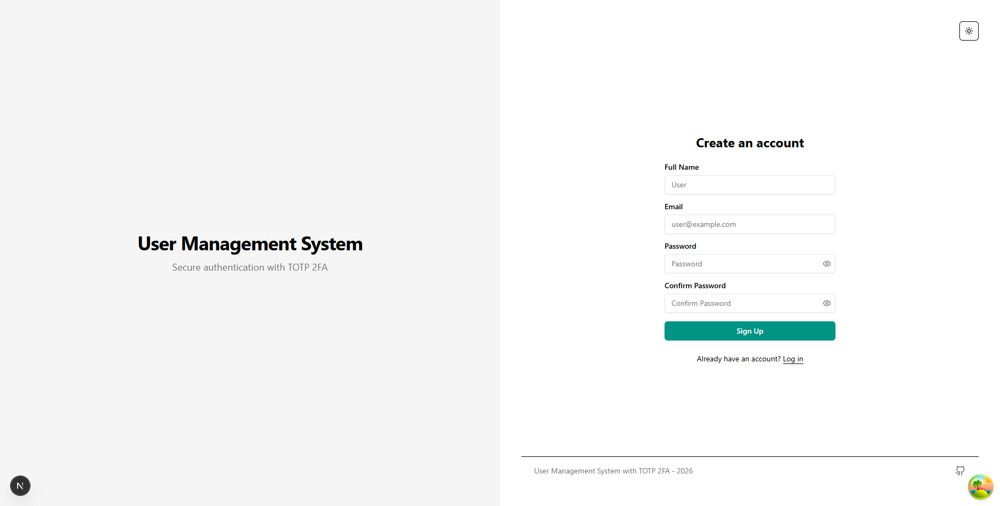

> **Screenshot**: `01-register.png`
> - Navigate to http://localhost:3000/signup
> - Show empty registration form
> - Highlight field labels and "Already have an account? Log in" link

---

### 1.2 Login - Email & Password

Entry point for all users. Requires email and password to proceed.

**Key elements**: Email field, password field (masked), Log In button, link to registration, forgot password link.

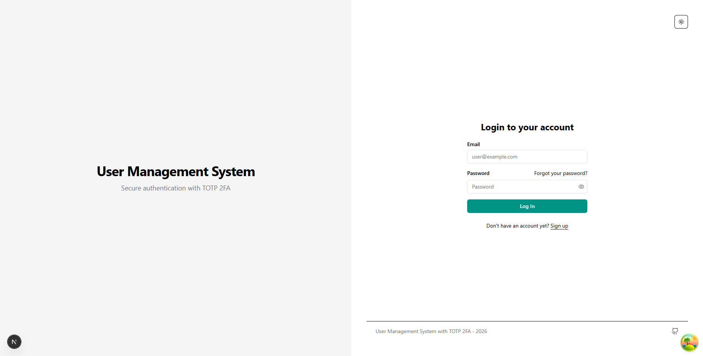

> **Screenshot**: `02-login-email.png`
> - Navigate to http://localhost:3000/login
> - Show the login form with email and password fields
> - Highlight "Forgot your password?" and "Sign up" links

---

### 1.3 Login - TOTP Verification

After email/password login, users enter a 6-digit code from their authenticator app.

**Key elements**: "Two-Factor Authentication" heading, 6-digit code input, Verify button, recovery code fallback.

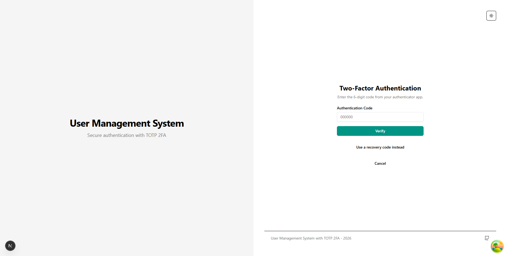

> **Screenshot**: `03-login-totp.png`
> - Enter credentials and click "Log In"
> - Show the TOTP verification screen with code input
> - Highlight "Use a recovery code instead" option

**Security**: Invalid code → "Invalid TOTP code". Reused code → "This code has already been used" (replay attack prevention).

---

### 1.4 TOTP Enrollment - Step 1: QR Code

First-time users must set up TOTP after registration. System generates a QR code for authenticator apps.

**Key elements**: QR code for scanning, manual entry key, instructions, "I've scanned the code" button.

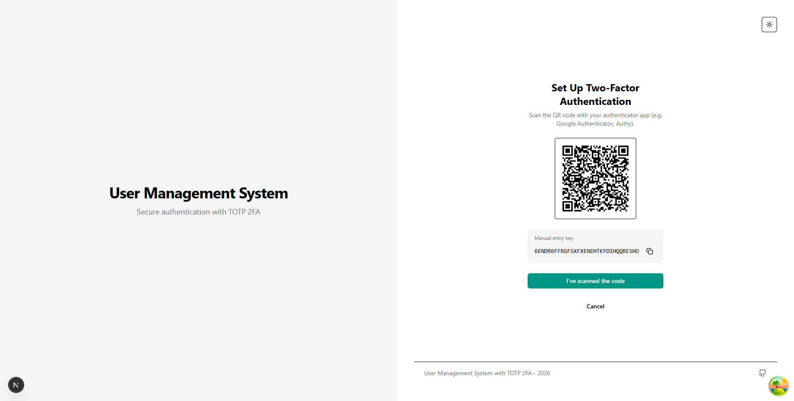

> **Screenshot**: `04-totp-enroll-qr.png`
> - Register a new user (e.g., `demo@example.com` / `DemoPass123`)
> - Show QR code screen after registration
> - Highlight QR code, manual entry key, and instructions

---

### 1.5 TOTP Enrollment - Step 2: Verify Code

User confirms the authenticator app is configured correctly by entering a code.

**Key elements**: "Confirm Your Code" heading, code input, "Activate 2FA" button, session countdown.

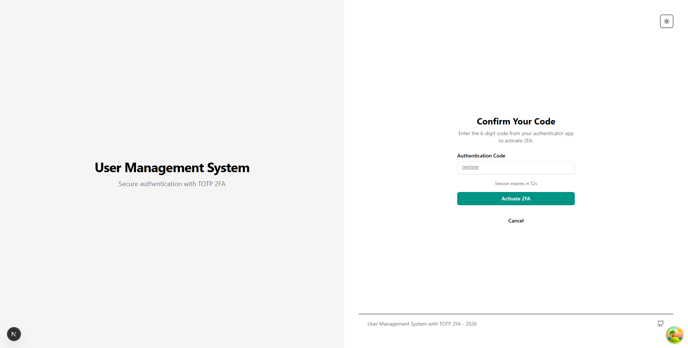

> **Screenshot**: `05-totp-enroll-verify.png`
> - After clicking "I've scanned the code"
> - Show verification screen with 6-digit code input
> - Highlight "Activate 2FA" button and session expiration timer

---

### 1.6 TOTP Enrollment - Step 3: Recovery Codes

After successful TOTP verification, system generates 10 single-use recovery codes.

**Key elements**: 10 recovery codes (XXXX-XXXX format), Copy and Download buttons, warning message.

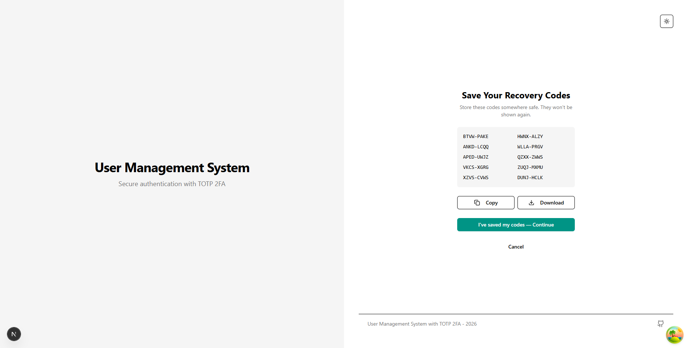

> **Screenshot**: `06-totp-recovery-codes.png`
> - After TOTP activation, show recovery codes screen
> - Highlight the grid of 10 codes
> - Show "Copy" and "Download" buttons with warning text

**Important**: Each code can only be used once. Store securely.

---

### 1.7 Login with Recovery Code

Alternative login method when authenticator app is unavailable.

**Key elements**: "Recovery Code" heading, input field (XXXX-XXXX format), format hint, back link.

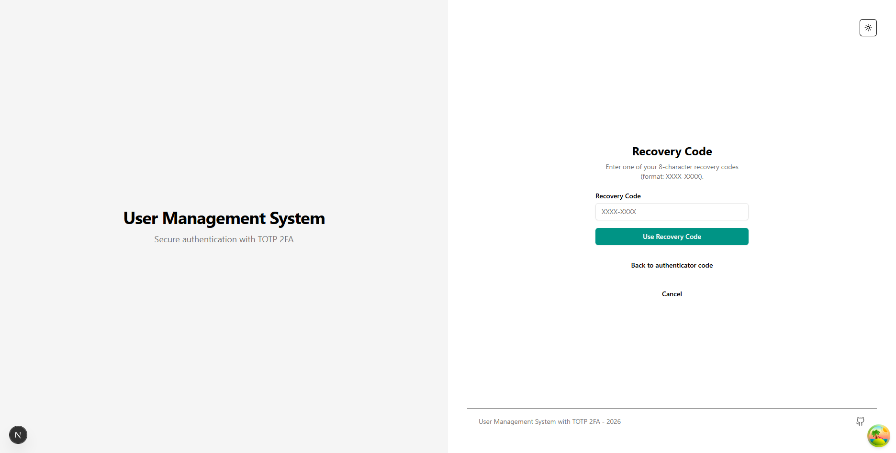

> **Screenshot**: `07-login-recovery.png`
> - Start login flow
> - After email/password, click "Use a recovery code instead"
> - Show recovery code input with format hint

---

## 2. Dashboard

Main dashboard after login for all users (regular users and admins).

**Key elements**: Welcome message with user email, sidebar navigation, clean interface, theme toggle.

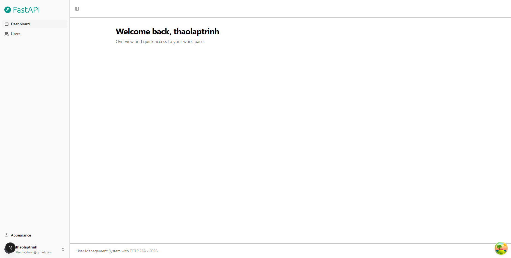

> **Screenshot**: `08-dashboard.png`
> - Login as any user
> - Show main dashboard with welcome message
> - Highlight sidebar navigation and theme toggle

---

## 3. User Management

### 3.1 User List Page

List all users in the system.

**Key elements**: "Users Management" heading, table with columns (Name, Email, Role, Status, Actions), pagination, Add User button.

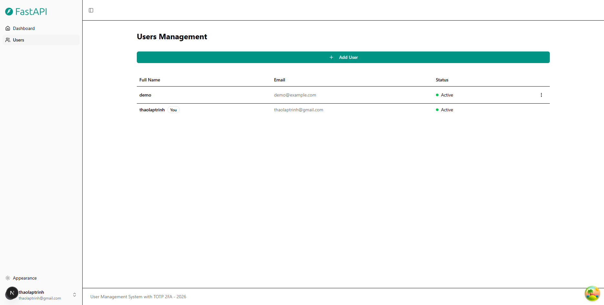

> **Screenshot**: `09-users-list.png`
> - Navigate to http://localhost:3000/users
> - Show user list table
> - Highlight multiple users, actions column, and "Add User" button

---

### 3.2 Add User Dialog

Form for creating new users.

**Key elements**: Full Name, Email, Password, Confirm Password fields, Role selection, Create/Cancel buttons.

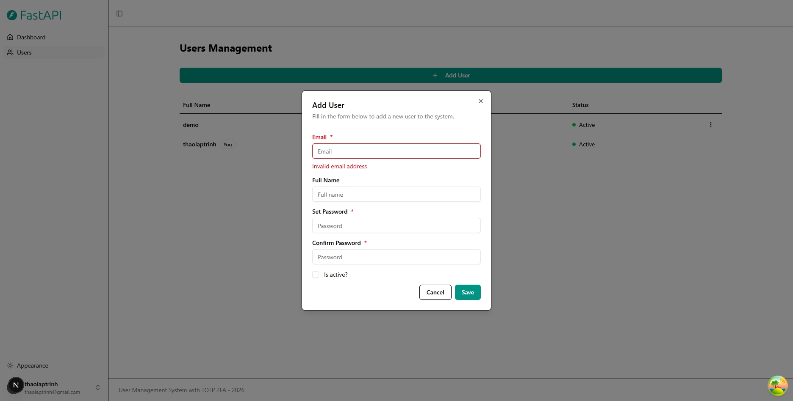

> **Screenshot**: `10-add-user.png`
> - Click "Add User" button
> - Show add user form/dialog
> - Highlight form fields and buttons

---

### 3.3 Delete User Confirmation

Confirmation dialog before deleting a user.

**Key elements**: Warning message, Delete and Cancel buttons, information about soft delete.

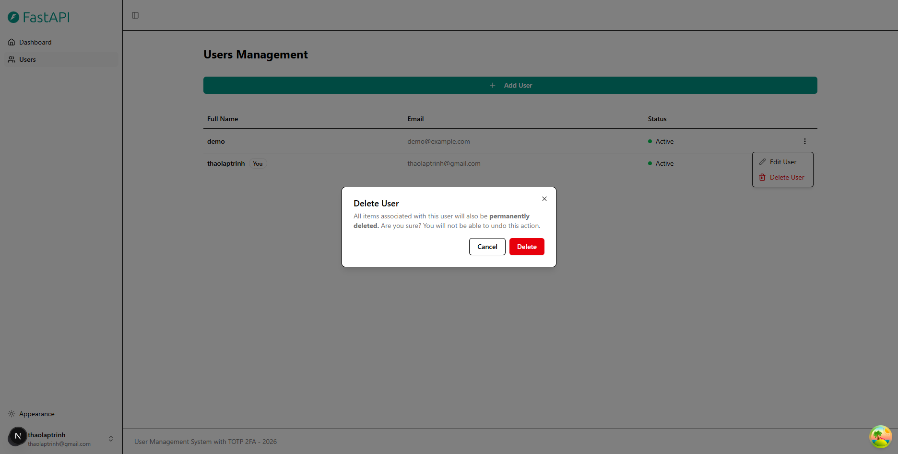

> **Screenshot**: `11-delete-user.png`
> - Click delete action on a user
> - Show confirmation dialog
> - Highlight warning and action buttons

---

## 4. User Settings

### 4.1 Settings - Profile Tab

User profile settings page.

**Key elements**: Settings heading, Profile/Password/Security tabs, user information form, Delete Account section.

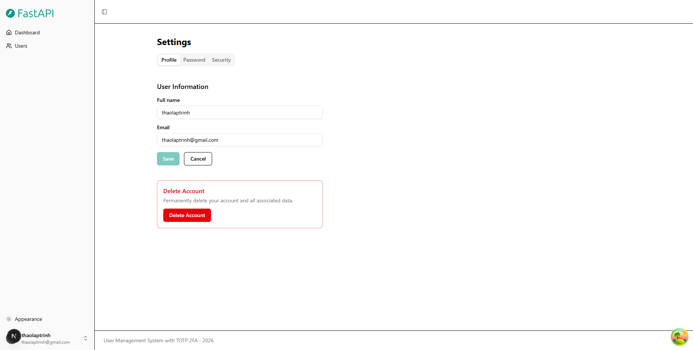

> **Screenshot**: `12-settings-profile.png`
> - Navigate to http://localhost:3000/settings
> - Show Profile tab with user information form
> - Highlight tabs and "Delete Account" section

---

### 4.2 Settings - Password Tab

Password change form with security features.

**Key elements**: Current Password, New Password, Confirm New Password fields, requirements, Update button.

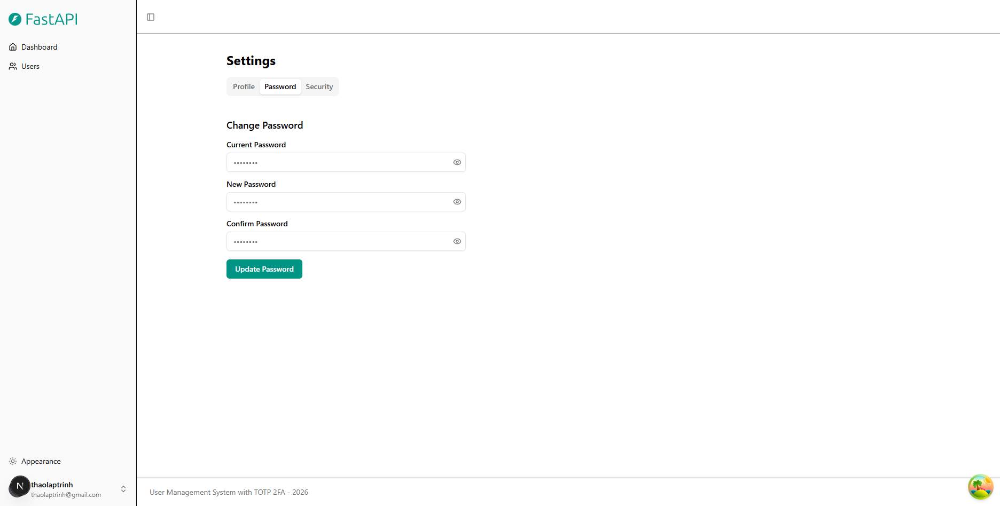

> **Screenshot**: `13-settings-password.png`
> - Click "Password" tab
> - Show change password form
> - Highlight password requirements and security note

**Security**: Validates current password, prevents reuse, increments password_version to invalidate other sessions.

---

### 4.3 Settings - Security (TOTP) Tab

TOTP status and management for enabled accounts.

**Key elements**: "Two-Factor Authentication" heading, Enabled status, recovery codes section, regenerate codes option.

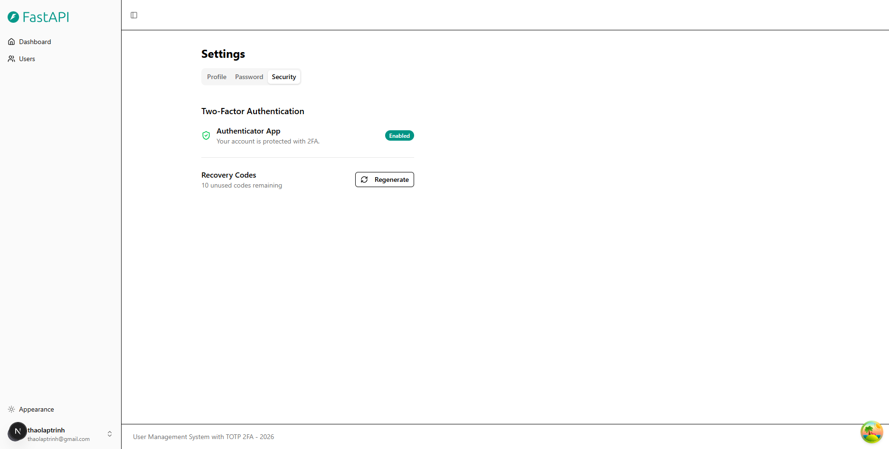

> **Screenshot**: `14-settings-security.png`
> - Click "Security" tab
> - Show TOTP settings for enabled user
> - Highlight "Enabled" status and recovery codes section

---

## 5. API Documentation

### 5.1 Swagger UI - Auth Endpoints

Interactive API documentation for authentication endpoints.

**Key elements**: Swagger UI interface, POST /api/v1/auth/login expanded, request schema, Try it out button.

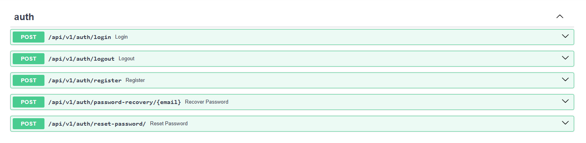

> **Screenshot**: `15-swagger-auth.png`
> - Navigate to http://localhost:8000/docs
> - Expand `/api/v1/auth/login` endpoint
> - Highlight request body schema and "Try it out" button

---

### 5.2 Swagger UI - TOTP Endpoints

TOTP management endpoints documentation.

**Key elements**: All TOTP endpoints (GET status, POST enroll, POST challenge, POST verify), method badges.

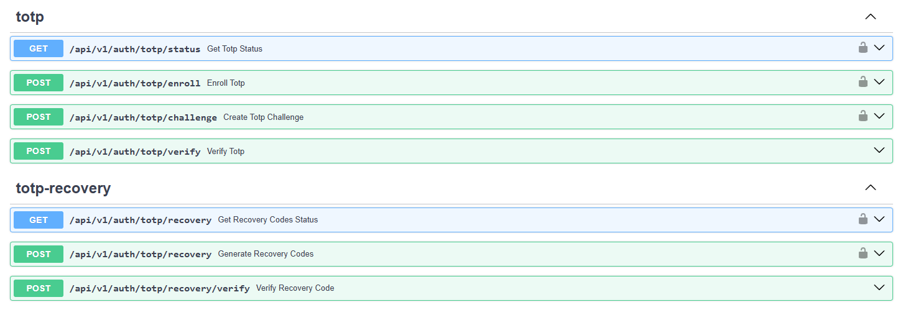

> **Screenshot**: `16-swagger-totp.png`
> - Scroll to TOTP section
> - Show all TOTP endpoints
> - Highlight color-coded method badges (GET, POST)

---

### 5.3 Swagger UI - Users Endpoints

User management endpoints documentation.

**Key elements**: User CRUD endpoints, authentication lock icons.

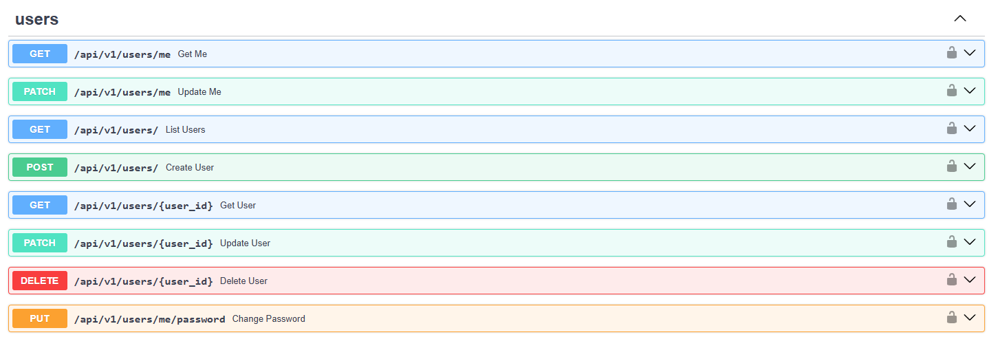

> **Screenshot**: `17-swagger-users.png`
> - Scroll to Users section
> - Show user management endpoints
> - Highlight lock icons indicating authentication required

---

## Complete User Flow

```
Register → Login (email/password) → Setup TOTP (first time) → Enter TOTP → Dashboard
                                      ↓                              ↓
                              Show Recovery Codes          OR Use Recovery Code
                              (save these!)                 (if app unavailable)
```

---

## Quick Start

```bash
# 1. Clone and setup
git clone https://github.com/thaolaptrinh/asm-user-management-system.git
cd asm-user-management-system
make init && make secrets

# 2. Start services
make dev

# 3. Access
# Frontend:  http://localhost:3000
# Backend:   http://localhost:8000
# Swagger:   http://localhost:8000/docs
```

---

## Taking Screenshots

Take screenshots of each section and save as PNG files to `screenshots/` with the exact filenames shown above (e.g., `01-register.png`, `02-login-email.png`, `03-login-totp.png`, etc.).

**Recommended specifications:**
- Resolution: **1872 x 948 px** (16:9 aspect ratio)
- Format: PNG (lossless compression)
- Browser: Full-screen mode (F11) for consistency
- Capture: Full page or visible content as appropriate
